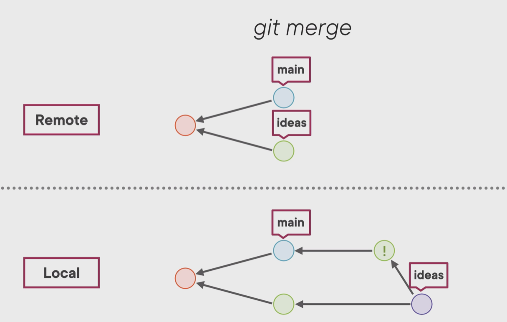
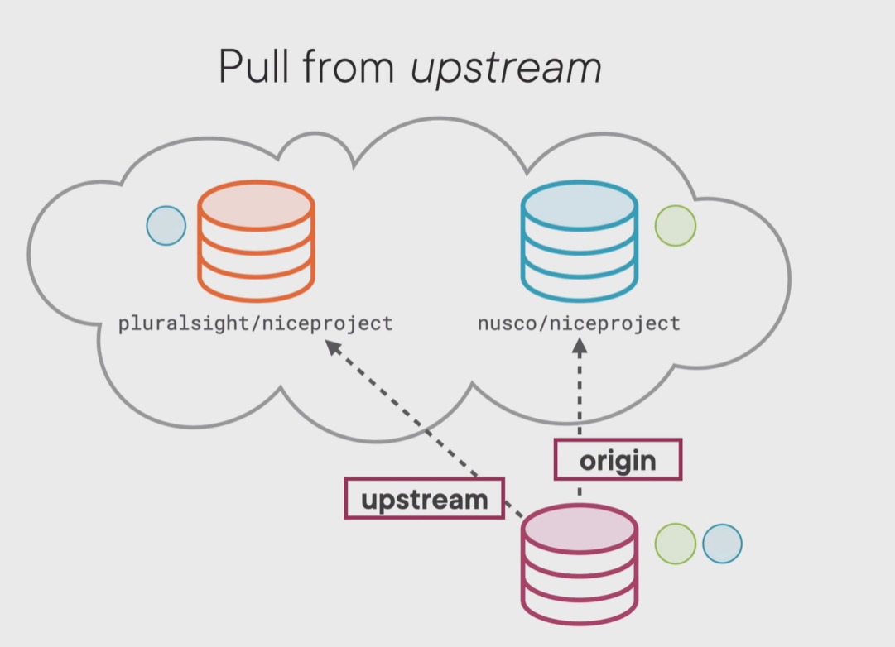

# Git

> Rui Chen
>
> note from free tutorial of pluralsight: [How git works]( https://www.pluralsight.com/courses/how-git-works)

## Introduction

### Porcelain Command

- High-level user command, e.g. git add/ commit/ pull/ push/ branch

### Plumbing Command

- Lower-level command, porcelain command build up on, e.g. git cat-file/hash-object.

## Git is

### Persistent map

- use key-value map to store objects
- use SHA-1 store objects (git hash-object)
- save in .git folder in a compressed version
- use git cat-file xxx -t (type) / -p (print) to unzip

### Stupid Content Tracker

Object Model:

- blob: content (not file, name of blobs (file name) stored at containing tree)
- tree: directory
- commit
- annotated tags: carry message of created person, message, etc. point to commits

commit point to trees and previous commit (if have)

### Revision Control System (Branch and Merges)

#### - Branch

branch is a file store in .git/refs/heads, stores a hash of a commit

```git
git branch // all branches
git branch test // create branch
git switch test // switch branch
```

current branch is saved at .git/HEAD contains reference of a branch. HEAD point to a branch.

- Merge

At main branch, merge test. 

Face conflict: 1. solve conflict files 2. add 3. commit (can commit without message, automatically generate) 

Merge commit has to parent commits

- Time Travel

At one branch, git only know the current commit and its tree and blobs, which is the entire state of the commit.

- Fast-forward merge

If the merge result is already exists, fast-forward merge will not create a new commit. It reuse the existing commit.

- Detached HEAD

```git checkout commit_hash```

HEAD directly point to one commit and branch is not effected.

Use ```git branch abc``` to create a new branch to save commit, otherwise it will be isolated and removed when git start to collect garbage.

#### - Rebase

base is where two commits diverges.

At test branch, rebase main branch:

1. New commits that same as the test branches from the latest commit to the base commit will be created. (same content but different hash)
2. two branch will become the same one, where test is front of the main.
3. The original commits in test branch will be unreachable and removed by garbage collector.

Merges and Rebase:

- merge has the exactly same content history. Too much branch is hard to follow.
- rebase will lose history information

#### - Tags

- annotated tag

create a tag object, which contains commit object and stores message

```git
git tag release_1 -a -m "first release" 
git checkout release_1
```

- light-weight tag

```git
git tag release //no message
```

###  Distributed Version Control

```git
git clone abc@xxx
```

> git clone command only copy one branch

Every repo in git is peer. It does not have a centralized repo.

.git/config contains other repository's information.

.git/refs/remotes will save the remote HEAD

``` git show-ref main``` show all branches contains name main

- remote branches is the same thing compared to local branches

```git
git push // send new local commits to the remote repo
```

#### conflict

other commits updated before the my local commits push.

- ```git push -f ``` : force push, cover the others' commits (not good idea)

- git fetch and git merge : ``` git pull ```, then push

  (never rebase shared commits, will cause rebase revisit)

  

#### GitHub Features

- Fork

  clone a git repo with no privilege on my account (**origin**).

  mark the repo with no privilege as (**upstream**)

  when upstream has new feature, pull to local, then push to the origin. (but we cannot directly push to the upstream from the local)

- Pull Requests

  send the origin new commits to the upstream repository

  


